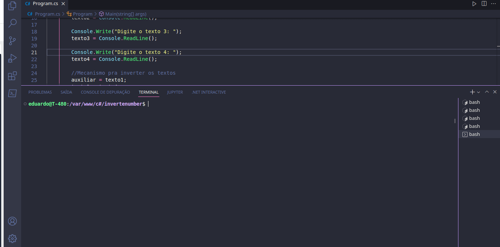

# Exercícios de fixação em C#

## invert-text

1. ***Aplicativo console para inverter nomes***

   

       
   

​																Exercicio elaborado através de aulas do Curso de C# da [Udemy](https://www.udemy.com/course/csharp-completo-e-profissional)

